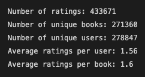
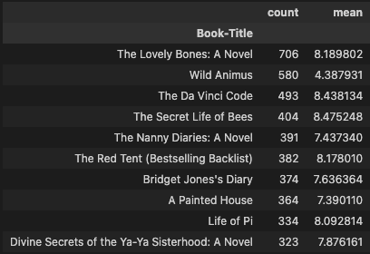
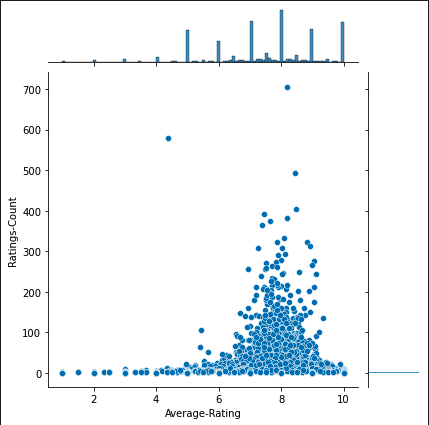

# Books Recommendation System

*[Low Light Photography of Books by Suzy Hazelwood](https://www.pexels.com/photo/low-light-photography-of-books-1301585/) | [Pexels Licensed](https://www.pexels.com/license/)*

# Description
The goal of this project is to develop a recommendation system that provides a list of 10 books that are similar to a book that a customer has already purchased. This system is built using machine learning and utilizes 3 datasets. The books dataset contains all the book titles, ISBNs, author, publisher and year of publication. The user dataset contains the user IDs, location and age. The ratings dataset contains user ids, location, age, ISBNs and book rating scores. All datasets are a subset of books available on Amazon.

The benefits of incoporating a recommendation system for any ecommerce business is to further market available book title offerings that align with past customer purchases to increase the customer's online shopping experience and to drive higher sales and greater revenue for the business.

All datasets have been sourced via [Kaggle's Books Dataset](https://www.kaggle.com/datasets/saurabhbagchi/books-dataset).

# Project Contents
1. For the data cleanup, refer to `cleanup.ipynb`.
2. For exploratory analysis and recommendation system, refer to `recommendations.ipynb`.
3. Raw and cleaned datasets are stored in the `Resources` folder.

# Libraries
In order to run this project, you will need the following libraries:

- pandas
- pathlib
- numpy
- re
- seaborn
- matplotlib
- scipy
- sklearn

# Data Cleanup 
To initiate the cleanup process a few key checks and actions were completed on all 3 datasets as required:
1. Check nulls
2. Check duplicates
3. Manage nulls/duplicates

Following this standard cleanup, each dataframe was explored for its unique qualities to determine what other cleanup decisions were required to optimize the recommendation system for performance.

## Books Data Cleanup

1. <b>Null Values</b> - Some null values were identified with the author and publisher, thus correct values were added to the books dataset from researching and cross-referencing ISBNs via [Amazon](https://www.amazon.com/) and [BookFinder](https://bookfinder.com/). 

2. <b>Year of Publication</b> - I discovered some years in the dataset for the year 0, 2024, 2026, 2030, 2037, 2038 and 2050. Evidently, the year 0 doesn't make sense and years in the future also do not make sense. All observations with these values were dropped. After this operation, the oldest publication year is set at 1376 and the most recent is 2021. 
3. <b>ISBNs and Book Titles</b> - It should be noted that there are duplicate book titles due to certain books having multiple publishers or different years of publication. For example, the Left Hand of Darkness by Ursula K. Le Guin was published in 1984 by Penguin Putnam-Mass and again in 1999 by Sagebrush Bound. At this time, these duplications have not been managed, but there is a future opportunity to consolidate these duplications to further refine the recommendation system. 

## Users Data Cleanup
1. <b>Age</b> - Age values that were less than 5 and greater than 90 were imputed to null values. This was done since I believe it is unlikely that a person younger than 5 and older than 90 would be submitting ratings for books purchased via Amazon. Null values were then imputed to the average age of 34.72 in the dataset.  
2. <b>Location</b> - Some location values were not null, but were strings 'n/a, n/a, n/a'. Observations with this value were dropped from the dataset. 

## Ratings Data Cleanup
1. <b>Book Rating - '0' </b> - There was a high count of book rating scores of 0. This score provides no value to the recommendation system and thus all observations with a 0 rating were removed from the dataset. 

# Exploratory Analysis

Exploring and understanding the data is important since we want to be sure we know what data and features are being fed into our machine learning model. Below I highlight some key statistics and visualizations.

## Key Dataset Statistics

## Top 10 Books with Highest Ratings Count
The books with the highest ratings count and mean include:

## Histogram - Ratings Count

Exploring the density of the book ratings count:

## Histogram - Average Rating

Exploring the average rating score. You'll notice there are peaks where books are rated from 5-10.

## Histogram - Ratings Average and Count Joint Plot

This joint plot shows a clear description over where the distribution of the ratings count lies. Each dot represents a book and you can see the vast majority of the average book rating lies in the score of 8 zone.

# Recommendation System

In order to feed the data into the machine learning model, the alphanumeric ISBN values had to be assigned unique integer IDs. This process was executed in the following steps:

1. Use `.ravel()` method to create array of unique ISBN values and store in `book_ids` variable.
2. Cast `book_ids` array to pandas series.
3. Convert `book_ids` to pandas DataFrame
4. Reset index of `book_ids`, rename columns to ISBN and Book-ID
5. Merge `book_ids` DataFrame with all other datasets

## Compressed Sparse Row Matrix
Leveraging the scipy library, I created a `create_matrix` function captured below:

Then, I feed the mapping values to X in preparation for the machine learning model:

## Scikit-Learn's NearestNeighbours

Finally, I create a `find_similar_books` function to feed the data through the K-Nearest Neighbours machine learning model:

 

# Recommendation Samples

## Since you read Brave New World:

## Since you read The Da Vinci Code:

# Resources

1. [Amazon](https://www.amazon.com/) - Cross-referencing null values with BookFinder.com
2. [BookFinder](https://bookfinder.com/) - Cross-referencing null values with Amazon.com
3. [Geeks For Geeks - Find location of an element in pandas dataframe in python](https://www.geeksforgeeks.org/find-location-of-an-element-in-pandas-dataframe-in-python/)
4. [Geeks for Geeks - How to check string is alphanumeric or not using regular expressions](https://www.geeksforgeeks.org/how-to-check-string-is-alphanumeric-or-not-using-regular-expression/)
5. [Geeks for Geeks - Recommendation system in Python](https://www.geeksforgeeks.org/recommendation-system-in-python/?ref=rp)
6. [Kaggle - Books Dataset](https://www.kaggle.com/code/saurabhbagchi/recommender-system-for-books) 
7. [Nick McCullum - Recommendations Systems Python](https://nickmccullum.com/python-machine-learning/recommendation-systems-python/)
8. [Stack Overflow - Assign Unique ID to columns pandas dataframe](https://stackoverflow.com/questions/33283086/assign-unique-id-to-columns-pandas-data-frame)
