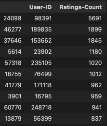
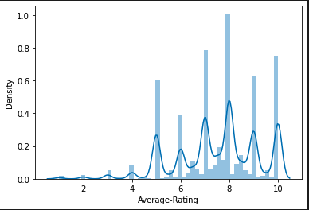
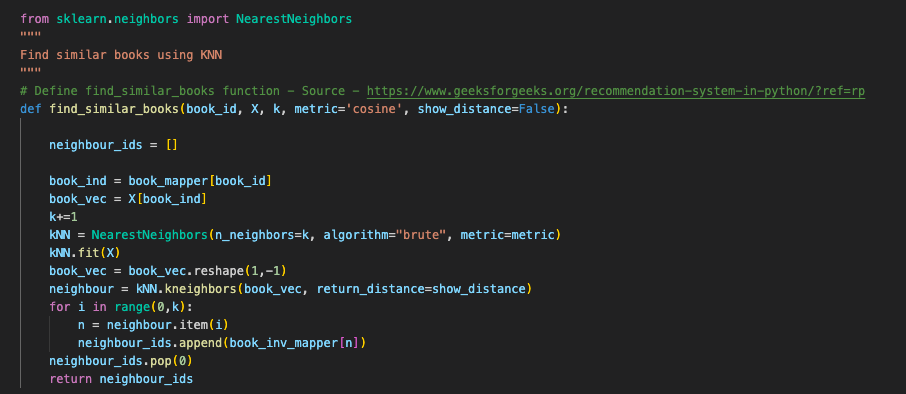
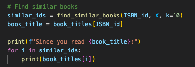
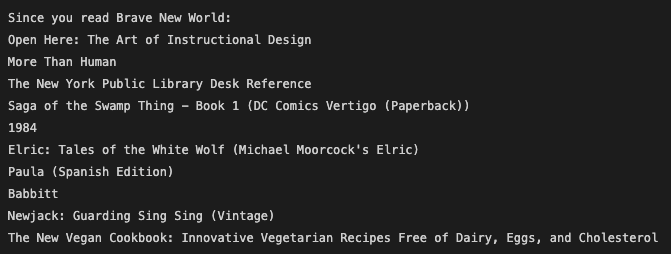
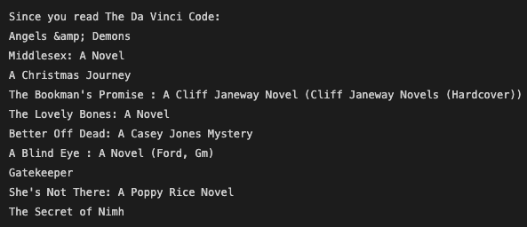

# Books Recommendation System

*[Low Light Photography of Books by Suzy Hazelwood](https://www.pexels.com/photo/low-light-photography-of-books-1301585/) | [Pexels Licensed](https://www.pexels.com/license/)*

# Description & Objective
The goal of this project is to develop a recommendation system that provides a list of 10 books that are similar to a book that a customer has read. This project will implement a collaborative-based filtering method via scikit learn's K-Nearest Neighbours clustering algorithm using the Amazon books dataset. The books data contains all the book titles, ISBNs, author, publisher and year of publication. The user dataset contains the user IDs, location and age. The ratings dataset contains user ids, ISBNs and book rating scores. All datasets are a subset of books available on Amazon.

All datasets have been sourced via [Kaggle's Books Dataset](https://www.kaggle.com/datasets/saurabhbagchi/books-dataset).

# Why Build a Recommendation System?

Ecommerce serves online customers through its product and service offerings, but in the world of big data, ecommerce businesses need to provide a signal amongst the noise. Efficient filtering to extract and provide useful value is critical to the success of an ecommerce business. This is where a recommendation system steps in.

Recommendation systems drive conversions, increase sales and revenue with an overall elevation of the customer experience to promote the growth of customer acquisition and satisfaction.

There are two popular primary recommendation system models.

1. Collaborative Filtering - Recommends items based on similarity measures between users and/or items leveraging the use of a user-item matrix.
2. Content-Based Filtering - Supervised machine learning to induce classifier to discriminate between interesting and uninteresting items for the user.

This project implements the collaborative filtering recommendation system.

# Collaborative Filtering

This model has a few core features that should be acknowledged when reviewing this project:

1. The model's assumption is that people generally tend to like similar things
2. Predictions are made based on item preferences of similar users
3. User-Item matrix is used to generate recommendations
4. Direct User Ratings are obtained through explicit feedback via rating scores
5. Indirect User Behavior can be obtained through implicit feedback such as listening, watching, purchasing, etc.)

This project is unable to incorporate indirect user behavior with the available dataset and thus it is excluded from this project.

# Project Contents
1. For the data cleanup, refer to `cleanup.ipynb`.
2. For exploratory analysis and recommendation system, refer to `recommendations.ipynb`.
3. Raw and cleaned datasets are stored in the `Resources` folder.

# Libraries
In order to run this project, you will need the following libraries:

- pandas
- pathlib
- numpy
- re
- seaborn
- scipy
- sklearn

# Data Cleanup 
To initiate the cleanup process a few key checks and actions were completed on all 3 datasets as required:
1. Check nulls
2. Check duplicates
3. Manage nulls/duplicates

Following this standard cleanup, each dataframe was explored for its unique qualities to determine what other cleanup decisions were required to optimize the recommendation system for performance.

## Books Data Cleanup

1. <b>Null Values</b> - Some null values were identified with the author and publisher, thus correct values were added to the books dataset from researching and cross-referencing ISBNs via [Amazon](https://www.amazon.com/) and [BookFinder](https://bookfinder.com/). 

2. <b>Year of Publication</b> - I discovered that some years in the dataset contained values for the year 0, 2024, 2026, 2030, 2037, 2038 and 2050. Evidently, the year 0 doesn't make sense and years in the future also do not make sense. All observations with these values were dropped. After this operation, the oldest publication year is set at 1376 and the most recent is 2021. 
3. <b>ISBNs and Book Titles</b> - It should be noted that there are duplicate book titles due to certain books having multiple publishers or different years of publication. For example, by Ursula K. Le Guin was published in 1984 by Penguin Putnam-Mass and again in 1999 by Sagebrush Bound. At this time, these duplications have not been managed, but there is a future opportunity to consolidate these duplications to further optimize the recommendation system. 

## Users Data Cleanup
1. <b>Age</b> - Age values that were less than 5 and greater than 90 were imputed to null values. This was done since I believe it is unlikely that a person younger than 5 and older than 90 would be submitting ratings for books purchased via Amazon. Null values were then imputed to the average age of 35 in the dataset.  
2. <b>Location</b> - Some location values were not null, but were actually strings of 'n/a, n/a, n/a'. Observations with this value were dropped from the dataset. 

## Ratings Data Cleanup
1. <b>Book Rating - '0' </b> - There was a high count of 716,109 book rating scores of 0 of the total 1,149,780 observations. The 0 rating provides no value to the recommendation system and thus all observations with a 0 rating were removed from the dataset. 

# Exploratory Analysis

The next step is to merge the 3 datasets into a single DataFrame. Exploring and understanding the data is important since we want to be sure we know what data and features are being fed into our machine learning model. Below I highlight some key statistics and visualizations.

## Key Merged Dataset Statistics

## Top 10 Books with Highest Ratings Count
The books with the highest ratings count and mean include:

## Top 10 User Ratings Count

## Histogram - Ratings Count

Most users don't rate heavily as shown in the above average ratings per user. Though, some 'super' raters do exist as shown in the top 10 user ratings count above.

## Histogram - Average Rating

There are major peaks where books are rated between 5-10.

## Histogram - Ratings Average and Count Joint Plot

Books with the most ratings are largely scored in the 5-10 zone with heavy concentration in the 7-9 zone.

# Recommendation System

In order to feed the data into the machine learning model, the alphanumeric ISBN values had to be assigned unique integer IDs. This process was executed in the following steps:

1. Use `.ravel()` method to create array of unique ISBN values and store in `book_ids` variable.
2. Cast `book_ids` array to pandas series.
3. Convert `book_ids` to pandas DataFrame
4. Reset index of `book_ids`, rename columns to ISBN and Book-ID
5. Merge `book_ids` DataFrame with larger merged dataset

## Compressed Sparse Row Matrix
Leveraging the scipy library, I created a `create_matrix` function captured below:

Then, I feed the mapping values to X in preparation for sklearn's K-Nearest Neighbours:

## Scikit-Learn's NearestNeighbours

Next, I create a `find_similar_books` function to feed the data through the K-Nearest Neighbours machine learning model:

Finally, I assign books to a dictionary to feed to the `find_similar_books` function.

## How to Find Recommendations

In order to find a recommendation, you will need to obtain the Book-ID from the ISBN since the `find_similar_books` value requires the Book-ID to provide recommendations.

# Recommendation Samples

## Since you read Brave New World:

## Since you read The Da Vinci Code:

# Next Steps

1. Performance evaluation
2. Tuning and exploring other machine learning models for best performance
3. Feature Engineering - Remove book title duplicates with unique ISBNs

This is an ongoing project and will be updated until the best performing recommendation system is developed.

# Resources

1. [Amazon](https://www.amazon.com/) - Cross-referencing null values with BookFinder.com
2. [BookFinder](https://bookfinder.com/) - Cross-referencing null values with Amazon.com
3. [Geeks For Geeks - Find location of an element in pandas dataframe in python](https://www.geeksforgeeks.org/find-location-of-an-element-in-pandas-dataframe-in-python/)
4. [Geeks for Geeks - How to check string is alphanumeric or not using regular expressions](https://www.geeksforgeeks.org/how-to-check-string-is-alphanumeric-or-not-using-regular-expression/)
5. [Geeks for Geeks - Recommendation system in Python](https://www.geeksforgeeks.org/recommendation-system-in-python/?ref=rp)
6. [Kaggle - Books Dataset](https://www.kaggle.com/code/saurabhbagchi/recommender-system-for-books) 
7. [Nick McCullum - Recommendations Systems Python](https://nickmccullum.com/python-machine-learning/recommendation-systems-python/)
8. [Stack Overflow - Assign Unique ID to columns pandas dataframe](https://stackoverflow.com/questions/33283086/assign-unique-id-to-columns-pandas-data-frame)
9. [Scikit-learn - NearestNeighbors](https://scikit-learn.org/stable/modules/generated/sklearn.neighbors.NearestNeighbors.html) 
10. [Scikit-learn - Sparse CSR Matrix](https://docs.scipy.org/doc/scipy/reference/generated/scipy.sparse.csr_matrix.html)
11. [Towards Data Science - Handling Sparse Matrix - Concept Behind Compressed Sparse Row (CSR) Matrix](https://towardsdatascience.com/handling-sparse-matrix-concept-behind-compressed-sparse-row-csr-matrix-4fe6abe58a7a)